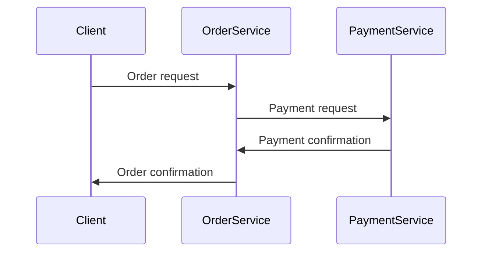
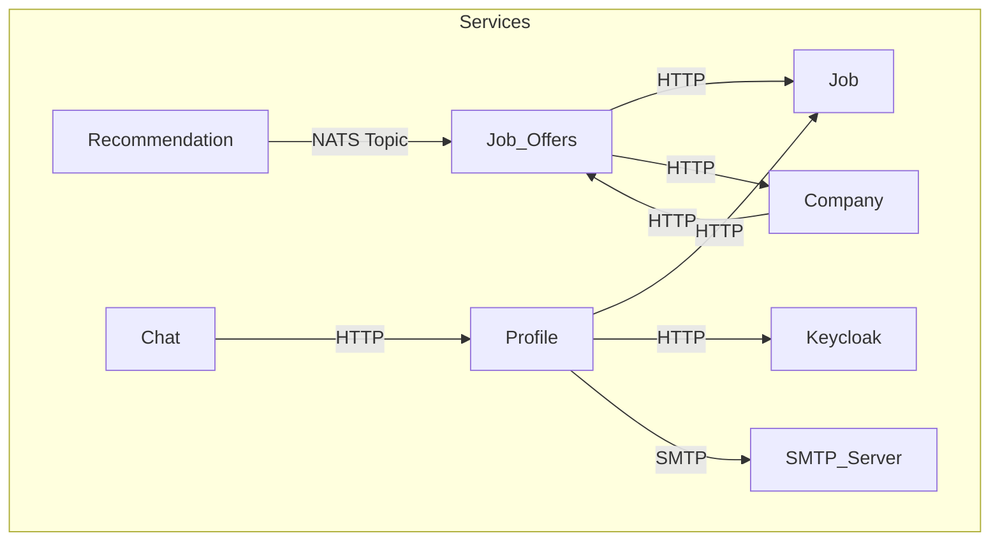
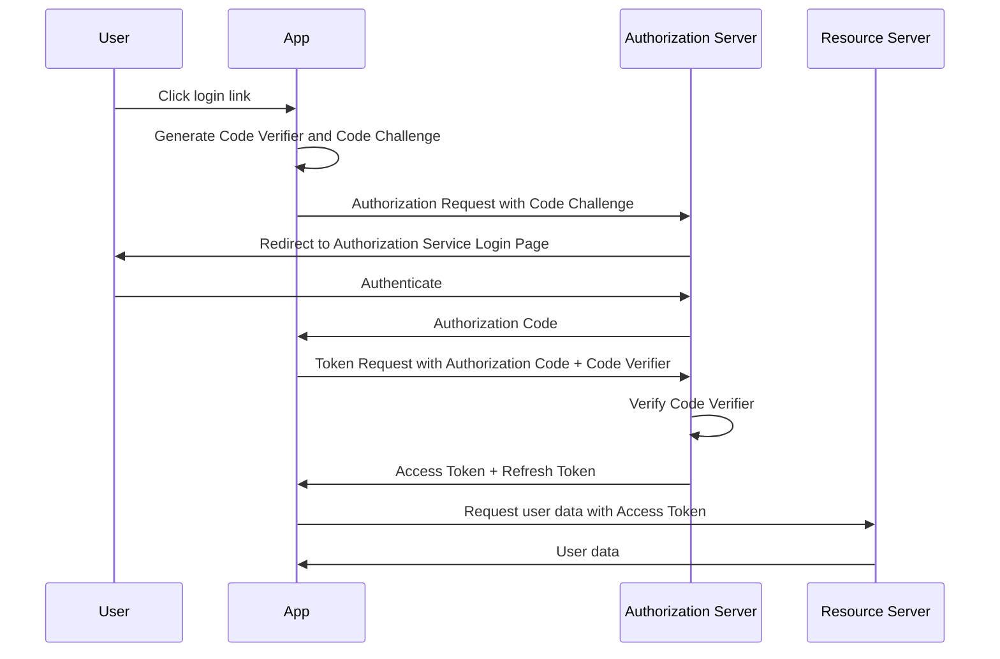
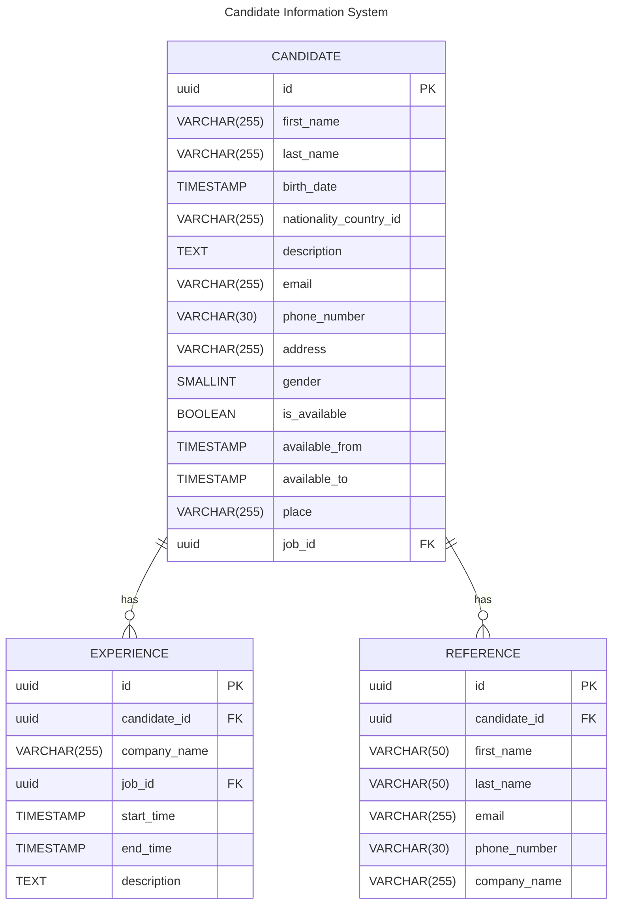
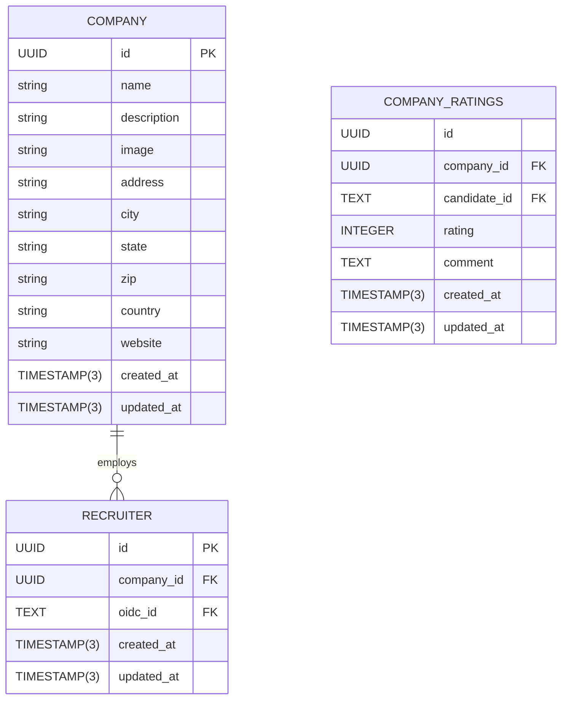
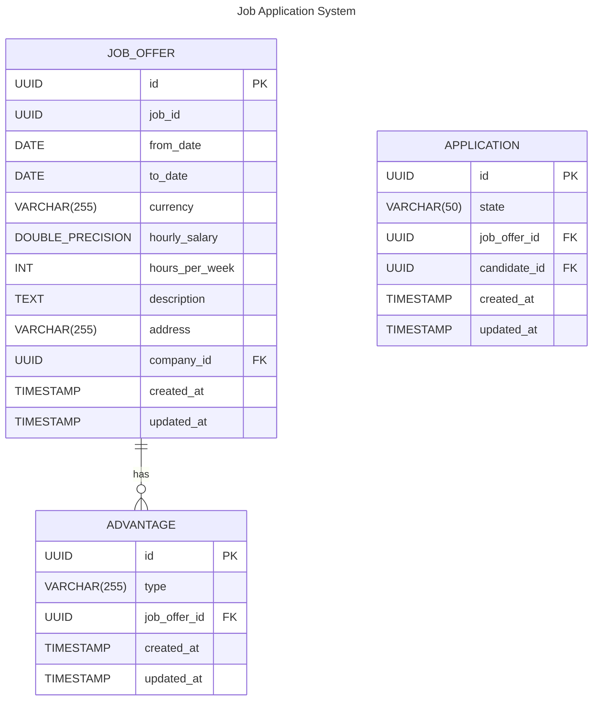
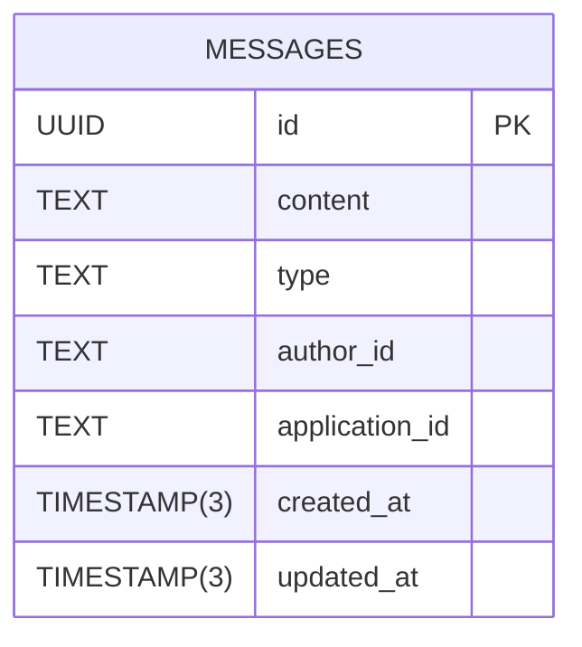
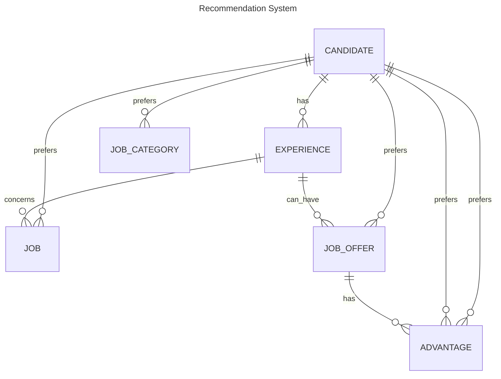
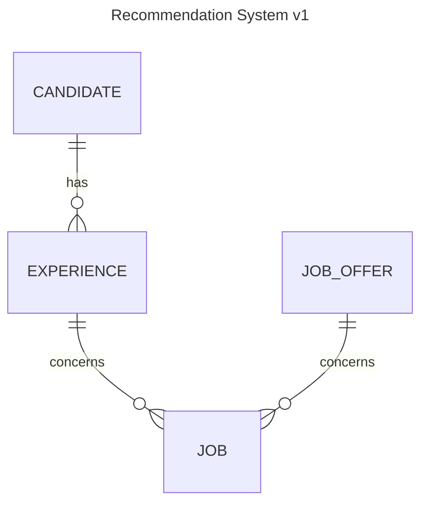
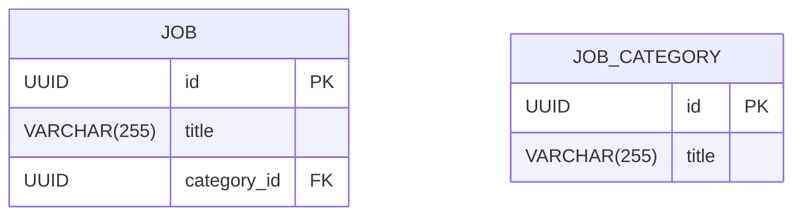

# Season Link

## Objective

The goal of this document is to provide a high-level overview of the project, its components, concepts, and how to run it.

## Summary

* [1. Microservice Architecture](#1-microservice-architecture)
   + [1.2. Monolithic applicationss](#12-monolithic-applicationss)
      - [1.2.1. Advantages](#121-advantages)
      - [1.2.2. Disadvantages](#122-disadvantages)
   + [1.3. What is the microservice architecture?](#13-what-is-the-microservice-architecture)
      - [1.3.1. Scaling](#131-scaling)
         * [1.3.1.1. Horizontal scaling](#1311-horizontal-scaling)
      - [1.3.2 Modularity](#132-modularity)
      - [1.3.3. Loose coupling](#133-loose-coupling)
      - [1.3.4. Benefits](#134-benefits)
      - [1.3.5. Drawbacks](#135-drawbacks)
   + [1.4. When to use the microservice architecture?](#14-when-to-use-the-microservice-architecture)
   + [1.5. How to decompose an application into microservices?](#15-how-to-decompose-an-application-into-microservices)
   + [1.6. Inter-service communication](#16-inter-service-communication)
      - [1.6.1. Synchronous communication](#161-synchronous-communication)
      - [1.6.2. Asynchronous communication](#162-asynchronous-communication)
      - [1.6.3. Choosing the right communication](#163-choosing-the-right-communication)
      - [1.6.4. Summary](#164-summary)
* [2 Season Link's architecture](#2-season-links-architecture)
   + [2.1. What is Season Link ?](#21-what-is-season-link-)
   + [2.2. User stories](#22-user-stories)
   + [2.3 Scope](#23-scope)
   + [2.4. Wireframe](#24-wireframe)
   + [2.5. General architecture](#25-general-architecture)
   + [2.6. How we decomposed the application into microservices](#26-how-we-decomposed-the-application-into-microservices)
   + [2.7. Inter-service communication](#27-inter-service-communication)
   + [2.8. Data storage](#28-data-storage)
* [3. Mobile application](#3-mobile-application)
   + [3.1 How the mobile application consumes the services](#31-how-the-mobile-application-consumes-the-services)
* [4. Authentication and Authorization](#4-authentication-and-authorization)
   + [4.1 OAuth 2.0](#41-oauth-20)
   + [4.2 OpenID Connect](#42-openid-connect)
   + [4.3 Authenticating the mobile application](#43-authenticating-the-mobile-application)
   + [4.4 Keycloak](#44-keycloak)
   + [4.5 Inter-service authentication and authorization](#45-inter-service-authentication-and-authorization)
* [5. Season Link's services](#5-season-links-services)
   + [5.1 Profile](#51-profile)
   + [5.1.1 Technologies](#511-technologies)
   + [3.1.2 Schema](#312-schema)
   + [5.1.3 File Storage](#513-file-storage)
   + [5.2 Company](#52-company)
      - [5.2.1 Technologies](#521-technologies)
      - [5.2.2 Schema](#522-schema)
   + [5.3 Job Offers](#53-job-offers)
      - [5.3.1 Technologies](#531-technologies)
      - [5.3.2 Schema](#532-schema)
      - [5.3.3 Asynchronous communication with the recommendation service](#533-asynchronous-communication-with-the-recommendation-service)
   + [5.4 Chat](#54-chat)
      - [5.4.1 Technologies](#541-technologies)
      - [5.4.2 Schema](#542-schema)
      - [5.4.3 How to mobile application gets the messages](#543-how-to-mobile-application-gets-the-messages)
   + [5.5 Recommendation](#55-recommendation)
      - [5.5.1 Technologies](#551-technologies)
      - [5.5.2 Why Neo4J ?](#552-why-neo4j-)
      - [5.5.3 Schema](#553-schema)
      - [5.5.4 Why does the recommendation service doesn't do the job offers service's job ?](#554-why-does-the-recommendation-service-doesnt-do-the-job-offers-services-job-)
   + [5.6 Job](#56-job)
      - [5.6.1 Technologies](#561-technologies)
      - [5.6.2 Schema](#562-schema)
   + [5.7 Gateway](#57-gateway)
      - [5.7.1 Technologies](#571-technologies)
      - [5.7.2 Authentication and Authorization](#572-authentication-and-authorization)
      - [5.7.3 Routing](#573-routing)
* [6. Infrastructure](#6-infrastructure)
   + [6.1. Kubernetes](#61-kubernetes)
   + [6.2. CI/CD](#62-cicd)
   + [6.3. Monitoring and Logging](#63-monitoring-and-logging)
* [7. Post-mortem](#7-post-mortem)
   + [7.1. What went well](#71-what-went-well)
   + [7.2. What went wrong](#72-what-went-wrong)
   + [7.3. What we would do differently](#73-what-we-would-do-differently)
* [8. Conclusion](#8-conclusion)

## 1. Microservice Architecture

### 1.2. Monolithic applicationss

Monolithic applications are built as a single deployable unit. All the application code is packaged together and deployed as a single unit.

This is the traditional way of building applications. It has its own advantages and disadvantages.

#### 1.2.1. Advantages

In the early days of the lifecycle of an application, a lot of aspects are easier with monoliths:

- Easier to develop and test the application.
- Easier to deploy the application.
- Easier to make radical changes to the application.
- Straightforward to test
- Easier to debug
- Easier to scale the application, you just need to run more instances with a load balancer in front of them.

#### 1.2.2. Disadvantages

As the application grows, the monolithic architecture starts to show its limitations:

- Harder to understand the application, especially for new developers.
- Development slows down as the application grows.
- The time it takes to deploy the application grows.
- Scaling is inefficient, you have to scale the entire application even if only a small part of it needs to be scaled.
- If one part of the application is under heavy load or is failing, it affects the entire application.
- It is harder to adopt new technologies, as the entire application needs to be rewritten to adopt a new technology.

### 1.3. What is the microservice architecture?

Today, when building large-scale applications, the monolithic architecture is often replaced with a microservice architecture. The question is, what are microservices ? We will use the following definition:

> A microservice architecture is a service-oriented architecture, composed of loosely coupled elements that have bounded contexts.

#### 1.3.1. Scaling

There are three ways to scale a web application:

- **Vertical scaling**: This is the traditional way of scaling an application. You add more resources to the server, such as CPU, memory, or storage. This is also known as scaling up.
- **Horizontal scaling**: This is the modern way of scaling an application.

Vertical obviously has hard limits, you can only add so much resources to a server. Horizontal scaling is the way to go for modern applications.

##### 1.3.1.1. Horizontal scaling

There are three ways to scale an application horizontally:

- **Adding more instances with a load balancer**: You add more instances of the application, and put a load balancer in front of them. The load balancer distributes the incoming requests to the instances randomly or based on some criteria.
- **Adding more instances and routing requests based on the request**: You add more instances of the application, and route the incoming requests to the instances based on the request. For example, you can route requests based on the user id, or the user's location.
- **Cutting the application into smaller services**: You cut the application into smaller services, which can be deployed independently.

Theses three ways are not mutually exclusive, you can use a combination of them to scale an application.

Monoliths can only use the first two ways to scale an application. However, it is inefficient, since some parts of the application may consume more resources than others, or different resources than others and still need to be scaled together.

For example a CPU intensive part of the application may need more CPU, but the rest of the application may need more memory. You can't scale the CPU intensive part of the application without scaling the rest of the application.

Microservices make the most out of the third way to scale an application. Since your application each service is independent, you can scale the services with the first two ways.

#### 1.3.2 Modularity

As they grow, monoliths, cannot be understood by a single developper, even though they can be modularized with libraries, you will end up with interdependencies between the libraries, and other anti-patterns.

Microservices is another way to modularize an application, you could see each service as a module, for example, a user module, an authentication module or a payment module becomes a user service, an authentication service and a payment service.

This makes the application easier to understand, and easier to develop for individuals or small teams.

#### 1.3.3. Loose coupling

Each service in a microservice architecture is loosely coupled. Each of them have their own database and their own codebase. They communicating with each other through APIs.

This has the advantage of making the application more resilient, if one service fails, the rest of the application can still work. And also results in better performance, since, for example, a database lock in one service does not affect the rest of the application, and the database can be optimized for the specific needs of the service.

#### 1.3.4. Benefits

The microservice architecture has several benefits:

- **Easier to understand**: The application is easier to understand, since it is composed of smaller services.
- **Easier to develop and maintain**: The application is easier to develop, since it can be developed by small teams or individuals.
- **Independent deployment and scaling**: Each service can be developed, deployed, and scaled independently.
- **Fault isolation**: If one service fails, the rest of the application can still work.

#### 1.3.5. Drawbacks

The microservice architecture has several drawbacks:

- **Testing**: Testing a microservice architecture is more complex than testing a monolithic architecture, since you have to test the interactions between the services.
- **Architecture complexity**: The microservice architecture is more complex than the monolithic architecture, since it involves more moving parts, inter process communication, you need to handle partial failures, and so on.
- **Operational complexity**: The microservice architecture is more complex to operate than the monolithic architecture, since you have to deploy, monitor, and scale more services.

### 1.4. When to use the microservice architecture?

The microservice architecture is not the alpha and omega. It has its own advantages and disadvantages, and it is not suitable for all applications.

It is suitable for large-scale applications, that have a lot of teams working on them, and that are expected to evolve rapidly. It could also be suitable for smaller application if they have different parts that have different scaling needs, or difficult processes that can be isolated in a service.

### 1.5. How to decompose an application into microservices?

There are several ways to decompose an application into microservices:

- **Domain-driven design**
- **Business capabilities**
- **User journeys**
- **Technical requirements**

Ultimately, the decomposition of an application into microservices is a matter of trade-offs. You have to balance the benefits and drawbacks of the microservice architecture, and the benefits and drawbacks of the decomposition.

### 1.6. Inter-service communication

In a microservice architecture, the services communicate with each other through APIs.

The choice of inter-service communication is important, since it has an impact on the performance, the scalability, the reliability, and the maintainability of the application.

There are two types of inter-service communication:

- **Synchronous communication**
- **Asynchronous communication**

#### 1.6.1. Synchronous communication

Synchronous communication is when the client waits for the server to respond. This is the traditional way of implementing APIs.

This includes:

- **REST**
- **GraphQL**
- **gRPC**
- etc.

Before choosing synchronous communication, you have to consider its drawbacks.

Take this example:



In the case of synchronous communication. The order service will wait for the payment service to answer his requests.

This means that failures of the payment service will affect the order service. The order service might hang, or fail, if the payment service is under heavy load, or is failing.

This means that we have to account for potential failures of the payment service in the order service. Should we retry the request ? Should we return an error to the client ? Should we keep the order in a pending state or should we cancel it ? In any case deciding what to do in case of failure is important.

Some solutions are:

- Network timeouts,
- Retries,
- [Circuit breakers](https://microservices.io/patterns/reliability/circuit-breaker.html)

You also need to consider how to handle discovery between services. How does the order service know where the payment service is ? How does the order service know if the payment service is up or down ? You could use approaches like [kubernetes service discovery](https://kubernetes.io/fr/docs/concepts/services-networking/dns-pod-service/), a [service mesh](https://www.redhat.com/en/topics/microservices/what-is-a-service-mesh), or a [service registry](https://microservices.io/patterns/service-registry.html).

Asynchronous communication can also have performance issues, since the client has to wait for the server to respond. If your application is not reactive, as opposed to blocking, it could block a thread for example, which uses resources.

#### 1.6.2. Asynchronous communication

When using messaging, services do not communicate directly with each other. Instead, they send messages to a message broker, which delivers the messages to the appropriate services.

This means that the client does not need to wait for the server to respond. If it does it should expect a later response.

One of the most common messaging patterns is the publish/subscribe pattern. In this pattern, a service publishes a message to a topic, and other services subscribe to the topic to receive the message.

Messages could contain data, commands or events.

- A command is a message that tells a service to do something. For example, a command could tell a service to create a user.
- An event is a message that tells a service that something has happened. For example, an event could tell a service that a user has been created.
- Data is a message that contains data. For example, a message could contain the data of a user.

Asynchronous communication can improve performance and availability. While making data consistency more difficult to achieve.

#### 1.6.3. Choosing the right communication

The choice of inter-service communication is important, since it has an impact on the performance, the scalability, the reliability, and the maintainability of the application.

Both ways of communication have their own advantages and disadvantages. You have to consider the benefits and drawbacks of each way of communication, and choose the one that best fits your application.

#### 1.6.4. Summary

In a microservice architecture, the services communicate with each other through APIs. The choice of inter-service communication is important, since it has an impact on the performance, the scalability, the reliability, and the maintainability of the application.

There are several ways to implement the APIs, such as REST, GraphQL, and gRPC. You have to consider the benefits and drawbacks of each way of communication, and choose the one that best fits your application.

You might not need to choose only one way of communication, you can use a combination of them to fit the needs of your application.

And finally, you have to make sure that you should understand that your application might not need to be decomposed into microservices, and that you should consider the drawbacks of the microservice architecture.

## 2 Season Link's architecture

### 2.1. What is Season Link ?

Season Link is a job board for seasonal jobs. It is a mobile application that connects job seekers with employers who are looking for seasonal workers.

### 2.2. User stories

- As a candidate I want to be able to create an account
- As a candidate I want to be able to delete my account
- As a candidate I want to be able to edit my profile
  - Personnal information
  - Contact information
  - Resume
  - Experiences
  - References (people that can vouch for your skills)
- As a candidate I want to be able to view a list of job offers for me
- As a candidate I want to be able to view all job offers
- As a candidate I want to be able to see the a review of companies on a job offer
- As a candidate I want to be able to apply to a job offer
- As a candidate I want to be able to chat with an employer
- As a candidate I want to be able to review a company I have worked for
- **As a candidate I want to receive notifications when I receive a message (including refusal/granting of a job offer)**
- As a candidate I want to be able to view the ratings I have received from my past employers
- As a candidate I want to be able to add a previous experience I've had on season link to my experiences
- As a recruiter I want to be able to leave a review on a worker I've employed through the app
- **As a recruiter I want to be able to view a list of candidates based on my subscription**
- **As a recruiter Platinium recruiter I want to be able to server push an offer to candidates**
- As a recruiter I want to be able to refuse / accept a candidate

Note: Items in bold are not implemented.

### 2.3 Scope

The admin doesn't have an interface, account deletion sends a mail to an admin containing the user's info with a link to delete it.

The recruiters have their own application and we do not manage it. We suppose authentication and authorization concerning them is done through that app.

This includes:

- adding candidate reviews
- consulting candidate lists
- subscriptions
- sending chats
- refusing / granting applicants to their job offers
- creating job offers

Hence, mock API will be created to mimic expected behavior.

### 2.4. Wireframe

The wireframe is a excalidraw file, you can download it <a id="raw-url" href="https://raw.githubusercontent.com/mmoreiradj/season-link/main/docs/assets/files/2023-10-02-18h13.excalidraw">here</a>.

### 2.5. General architecture

The architecture of Season Link is a microservice architecture. It is composed of several services, each of them has a bounded context.

The main services are:

- **Profile**: This service is responsible for managing the profiles of the candidates. It is responsible for creating, reading, updating, deleting the profiles of the candidates and rating the companies.
- **Company**: This service is responsible for managing the companies. It is responsible for creating, reading, updating, deleting the companies and rating the companies.
- **Job**: This service is responsible for managing the job offers. It is responsible for reading job offers and categories.
- **Chat**: This service is responsible for managing the messages between the candidates and the companies. It is responsible for sending and receiving messages.
- **Recommendation**: This service is responsible for recommending job offers to the candidates.
- **Job Offers**: This service is responsible for managing the job offers. It is responsible for creating, reading, updating job offers and categories.
- **Gateway**: This service is responsible for routing the requests to the appropriate services.

There are also external services such as:

- **SMTP server**: This service is responsible for sending emails.
- **Databases**: This service is responsible for storing the data of different services.
- **Message broker**: This service is responsible for managing the messages between the services.
- **Keycloak**: This service is responsible for authentication and authorization.

There are also external services such as a smtp server, databases, a message broker and keycloak for authentication and authorization.

Here's a graph of the services and their interactions:



Note: The gateway is not represented in the graph, it is responsible for routing the requests to the appropriate services. We followed the [API Gateway pattern](https://microservices.io/patterns/apigateway.html).

Each of theses services are explained in further details in the following sections.

### 2.6. How we decomposed the application into microservices

We decomposed the application into services that can be developped, deployed, and scaled by small teams or individuals.

We used domain-driven design to decompose the application while keeping in mind the technical requirements of each domain. Another driving factor was the dependencies between the services. We wanted to avoid circular dependencies, and the need for distributed transactions.

### 2.7. Inter-service communication

As you can see on the previous diagram, most of our communication is done synchronously over HTTP. The services communicate with each other through Rest APIs. We've made the choice of synchronous communication for simplicity and because our services do not have major dependencies between each other, they mainly use each other for validation and data retrieval. Thanks to that we can avoid distributed transactions and the complexity that comes with it.

We still used a message broker for the recommendation service. Indeed, when a job offer, or related data, is created, updated or deleted, the recommendation service needs to update its recommendations. We used a message broker to decouple the services and improve the durability of the system.

Our message broker is [NATS](https://nats.io/), a high-performance messaging system that acts as a message broker for our microservices architecture.

It has retry mechanisms and allows us to store the messages for a certain amount of time, which is useful in case of failure of the recommendation service.

### 2.8. Data storage

Each service has its own database. That way we can edit the schema of each service without affecting the others, it also avoids locks and performance issues.

For relational databases, we used PostgreSQL, a powerful, open source object-relational database system with over 30 years of active development that has a strong reputation for reliability, feature robustness, and performance.

In the non-relational databases, we used Neo4j, a graph database management system developed by Neo4j, Inc. It is optimized for storing and querying graphs containing highly interconnected data. It is ACID-compliant and suitable for OLTP applications. We used it for the recommendation service. See [5.5.2 Why Neo4J ?](#5.5.2-why-neo4j-) for more information.

## 3. Mobile application

The mobile application is developed using React Native. It is a cross-platform framework that allows us to develop mobile applications for iOS and Android using a single codebase.

It's mainly targeted at candidates, and it allows them to create an account, edit their profile, view job offers, apply to job offers, chat with employers, review companies, etc.

The code is organized by domain, and we used Redux for state management and api calls.

### 3.1 How the mobile application consumes the services

When making monolithic applications, the client just has to consume the monolith's API. However, when making microservices, the client would have to consume multiple APIs, and some of them might not even be public or might not be accessible with HTTP.

To avoid this there are multiple solutions:

- **API Gateway**: ALl clients consumes a single API, the API Gateway.
- **Backend for Frontend**: Each client consumes a specific API, the Backend for Frontend. The mobile application would consume the mobile BFF, the web application would consume the web BFF, etc.

Using an API Gateway is the most common way to consume multiple services from a client, it allows us to:

- Route requests to the appropriate services
- Aggregate data from multiple services
- Translate between protocols
- Manage front facing authentication and sometimes authorization
- Manage Rate limiting
- Manage Cache
- Log requests

And all this from a single point of entry instead of having to manage all of this in the client or in each microservice.

## 4. Authentication and Authorization

Authentication is the process of verifying the identity of a user. Authorization is the process of verifying what a user is allowed to do.

It is an important part of any application since it manages the access to the application and its data.

Such a system is complex to implement, maintain and secure. It is also a common point of failure and a common target for attackers. On top of that, if you do not use existing protocols, external clients or developpers will have to learn how to use your system. Your clients might also be unable to use external authentication providers such as Google, Facebook, etc.

For these reasons, and to make sure we want to support the OAuth 2.0 protocol and more precisely the OpenID Connect protocol.

### 4.1 OAuth 2.0

OAuth 2.0 is an authorization framework that enables a third-party application to obtain limited access to an HTTP service, either on behalf of a resource owner by orchestrating an approval interaction between the resource owner and the HTTP service, or by allowing the third-party application to obtain access on its own behalf without a password.


This protocol involves multiple actors:

- **Resource Owner**: This is the end-user granting access to their account.
- **Resource Server**: The server hosting the protected resources, capable of accepting and responding to protected resource requests using access tokens.
- **Client**: An application making requests on behalf of the resource owner. (The mobile application in our case)
- **Authorization Server**: The server that authenticates the resource owner and issues access tokens after getting proper authorization.

This allows us to focus on the resource server and the client, and let the authorization server handle the authentication and authorization. Similarly, we can use external authorization servers such as Google, Facebook, etc.

### 4.2 OpenID Connect

OpenID Connect (OIDC) is an authentication layer built on top of OAuth 2.0, providing a simple identity layer on which applications can build trusted authentication. While OAuth 2.0 is primarily an authorization framework, OpenID Connect extends it to provide user authentication and identity information, meaning the email, the phone number, the name, etc.

Key Concepts:

- **ID Token**: A token that contains information about the user. It is a JSON Web Token (JWT) that is used to pass the identity of the user between the client and the server.
- **UserInfo Endpoint**: An endpoint that returns information about the user. It is used to get more information about the user, such as their email, their name, etc.
- **Discovery Endpoint**: An endpoint that returns information about the OpenID Connect provider. It is used to get the configuration of the OpenID Connect provider, such as the authorization endpoint, the token endpoint, etc.
- **Scopes**: A scope is a permission that the client requests from the user. For example, the client can request the openid scope to get the ID Token, or the profile scope to get the user's profile information.

### 4.3 Authenticating the mobile application

To authenticate the mobile application, we used to PKCE flow. It is an extension of the Authorization Code flow, which is an OAuth 2.0 flow that is used for web applications.

The PKCE flow is used for public clients, such as mobile applications, that cannot store a client secret. It is more secure than the Implicit flow, which is used for public clients, such as single-page applications, that cannot store a client secret. More information can be found [here](https://oauth.net/2/pkce/).

Here's a diagram of the PKCE flow:



### 4.4 Keycloak

Keycloak is an open source identity and access management solution. It makes it easy to secure applications and services with little to no code. It is developed by Red Hat and is based on the OAuth 2.0 and OpenID Connect protocols.

It allows you to manage users, roles, and permissions, and to authenticate and authorize users.

We used it to authenticate and authorize the mobile application.

### 4.5 Inter-service authentication and authorization

Since all the requests are proxied through the gateway, we can use the gateway to authenticate and authorize the requests. It is the resource server in the OAuth 2.0 protocol.

However what about the communication between the services ? We could use the same approach, but it would be inefficient, since the gateway would have to authenticate and authorize the requests for each service.

Instead, we used a different approach, since the services are in the same isolated network, we trust the requests coming from the services. The gateway simply routes the requests, adding the headers `X-User-Id` and `X-User-Roles` to the requests, which contain the user id and the user roles.

The services then use these headers to authenticate and authorize the requests.

Obviously, this is not ideal, a better solution would be to use a service mesh, such as Istio, which would handle the authentication and authorization for us. It would also handle the retries, the circuit breaking, the rate limiting, etc. 

## 5. Season Link's services

### 5.1 Profile

The profile service is responsible for managing the profiles of the candidates. It is responsible for creating, reading, updating, deleting the profiles of the candidates and rating the companies. It also manages account creation and deletion from keycloak.

### 5.1.1 Technologies

It is developed with the following technologies:

- **Language**: Rust
- **Framework**: Axum
- **Database Server**: PostgreSQL
- **Database Client**: sqlx

We chose Rust for its performance, safety, and concurrency with the Axum framework for its ergonomics. Since we want the data to be consistent, we chose PostgreSQL for its ACID compliance. We used sqlx as a database client for its ergonomics and performance.

Since Axum uses tokio under the hood, we can avoid blocking resources which very important when doing synchronous communication across services via HTTP.

### 3.1.2 Schema

The profile service has the following schema:



### 5.1.3 File Storage

The CVs are stored on a s3 bucket.

### 5.2 Company

#### 5.2.1 Technologies

It is developed with the following technologies:

- **Language**: TypeScript
- **Framework**: NestJS
- **Database Server**: PostgreSQL
- **Database Client**: Prisma

TypeScript was chosen for its type safety. NestJS was chosen for its ergonomics and dependency injection system. We chose PostgreSQL for its ACID compliance. We used Prisma as a database client for its ergonomics and performance.

We are also most familiar with TypeScript and NestJS which made development fast.

Node's event loop is also non-blocking, which is important when doing synchronous communication across services via HTTP.

#### 5.2.2 Schema



### 5.3 Job Offers

The job offers service is responsible for managing the job offers. It is responsible for creating, reading, updating job offers and categories. It also manages the applications to the job offers.

#### 5.3.1 Technologies

It is developed with the following technologies:

- **Language**: Kotlin
- **Framework**: Spring Boot WebFlux
- **Database Server**: PostgreSQL
- **Database Client**: R2DBC

Kotlin was chosen for its type safety and conciseness. Spring Boot WebFlux was chosen for the fact it's reactive. We chose PostgreSQL for its ACID compliance. We used R2DBC as a database client for its ergonomics and performance.

Note that we did not use the traditional Spring Boot libraries, but the WebFlux version, which is non-blocking and reactive, the same goes for R2DBC. Again, this is important when doing synchronous communication across services via HTTP.

#### 5.3.2 Schema



#### 5.3.3 Asynchronous communication with the recommendation service

When a job offer is created, updated or deleted, the recommendation service needs to update its recommendations. We used a message broker to decouple the services and improve the durability of the system.

Each time a job offer is created, updated or deleted, a message is sent to the message broker. The recommendation service listens to the message broker and updates its recommendations accordingly. As to why the job offer service does not make the recommendations itself, you can refer to the [5.5.4 Why does the recommendation service doesn't do the job offers service's job ?](#5.5.4-why-does-the-recommendation-service-doesnt-do-the-job-offers-services-job-).

### 5.4 Chat

The chat service is responsible for managing the messages between the candidates and the companies. It is responsible for sending and receiving messages.

#### 5.4.1 Technologies

See [3.2.1 Technologies](#3.2.1-technologies).

#### 5.4.2 Schema



#### 5.4.3 How to mobile application gets the messages

Ideally, we would have implemented server-sent events, but we did not have the time to do so. Instead, the mobile application polls the chat service for new messages.

### 5.5 Recommendation

The recommendation service is responsible for recommending job offers to the candidates.

#### 5.5.1 Technologies

It is developed with the following technologies:

- **Language**: Go
- **Framework**: Http
- **Database Server**: Neo4j
- **Database Client**: Golang driver for Neo4j

We chose Go for its performance, integration with NATS, and its concurrency.

#### 5.5.2 Why Neo4J ?

Our data is richly interconnected. Indeed, we have the following relationships:



Obviously, it is incomplete, but it gives an idea of how interconnected our data can be. This is why we chose Neo4J. It is optimized for storing and querying graphs containing highly interconnected data. It is ACID-compliant and suitable for OLTP applications.

Managing such complex relationships in a relational database would have been complicated and not performant.

#### 5.5.3 Schema

For now, we only support the following relationships:



For our first version, we only support recommendations of job offers based on the candidate's experiences.

Example Query:

```cypher
MATCH (job:Job {id: $job_id})
MATCH (advantage:Advantage)
WHERE advantage.type IN $advantages
MATCH (jobOffer:JobOffer)-[:FOR_JOB]->(job)
MATCH (jobOffer)-[:FOR_JOB_OFFER]->(advantage)
RETURN jobOffer.id, jobOffer.to_date, jobOffer.from_date, jobOffer.company_id, job.id
```

This query returns the job offers that match the candidate's experiences.

#### 5.5.4 Why does the recommendation service doesn't do the job offers service's job ?

Since PostgreSQL is not good at managing complex relationships, we use Neo4J. However, why not use Neo4J for the job offers service as well ?

While Neo4J is more performant than PostgreSQL, it is not as performant as PostgreSQL for insertions, reads, full-text search, and other operations.

### 5.6 Job

The job service is responsible for managing the job. It is responsible for reading job and job categories.

#### 5.6.1 Technologies

It is developed with the following technologies:

- **Language**: Java
- **Framework**: Quarkus RESTEasy
- **Database Server**: PostgreSQL
- **Database Client**: Hibernate Reactive Panache

Similarly to our services using Spring Boot WebFlux and R2DBC, this service uses Quarkus RESTEasy and Hibernate Reactive Panache for their non-blocking and reactive capabilities.

We wanted to try out Quarkus and Hibernate Reactive Panache, and chose Java because we are more familiar with it than with Kotlin. Since quarkus has less online resources than spring boot, we chose Java for its larger community.

#### 5.6.2 Schema



Not that for now we have no support for internationalization on the job service, but it is planned.

### 5.7 Gateway

The gateway service is responsible for routing the requests to the appropriate services.

#### 5.7.1 Technologies

It is developed with the following technologies:

- **Language**: Kotlin
- **Framework**: Spring Cloud Gateway (WebFlux)

See [3.3.1 Technologies](#3.3.1-technologies).

#### 5.7.2 Authentication and Authorization

The gateway is responsible for protecting the services. It is configured to use the discovery endpoint of Keycloak to get the configuration of Keycloak, such as the authorization endpoint, the token endpoint, etc.

#### 5.7.3 Routing

Since all our services expose an HTTP API, the gateway simply routes the requests to the appropriate services. There is no need to protocol translation.

## 6. Infrastructure

### 6.1. Kubernetes

We used Kubernetes to deploy our services. Kubernetes is an open-source container-orchestration system for automating computer application deployment, scaling, and management.

One of the most important features for us is the service discovery (which fixes one of the drawbacks of synchronous communication), the load balancing, and the ability to scale the services.

### 6.2. CI/CD

We used GitHub Actions for our CI/CD. It is a continuous integration and continuous deployment service developed by GitHub.

When tagging a branch, the CI/CD pipeline is triggered.

- it builds the docker images
- it pushes the docker images to the registry
- it edits the helm chart with the new version
- argocd, our CD tool, detects the change and updates the deployment on the kubernetes cluster

The helm charts and the argocd configuration are stored in `infra/`.

### 6.3. Monitoring and Logging

Microservices are inherently more complex than monoliths, and they have more moving parts. This makes monitoring more complex.

We used Grafana and Prometheus for our monitoring. Grafana is a multi-platform open source analytics and interactive visualization web application. It provides charts, graphs, and alerts for the web when connected to supported data sources. Prometheus is an open-source monitoring and alerting toolkit.

For our logging, we used Loki, which is a horizontally-scalable, highly-available, multi-tenant log aggregation system.

## 7. Post-mortem

### 7.1. What went well

- **Development environment**: We used Docker to create a development environment that is as close as possible to the production environment, and setup a code, build, run loop that is automated with docker-compose.

### 7.2. What went wrong

- **Lack of experience with some technologies**: We used some technologies that we were not familiar with, such as Axum, Quarkus, and R2DBC. This slowed us down, and we had to learn these technologies on the fly.
- **Lack of understanding of the microservice architecture**: We did not fully understand the microservice architecture, and we had to learn it on the fly. This resulted in some design mistakes, and time wasted.
- **Lack of contracts**: We did not define the contracts between the front-end and the back-end, some routes were not well defined and some missing.
- **Technical difficulties with React Native**: 

### 7.3. What we would do differently

- **Read more about the microservice architecture**: We would read more about the microservice architecture before starting the project, and we would define the contracts between the services and the front-end.
- **Define the contracts**: We would define the contracts between between all the services and the front-end, and we would use a contract-first approach. gRPC would have been a good choice for that.

## 8. Conclusion

In conclusion, we learned that we mainly learnt about protocols like OAuth 2.0 and OpenID Connect, and technologies such as Spring Boot, Rust, Neo4J, Quarkus and NATS.

As for the microservice architecture, we felt our understanding of it was superficial, and we would have liked to learn more about it before starting the project.
